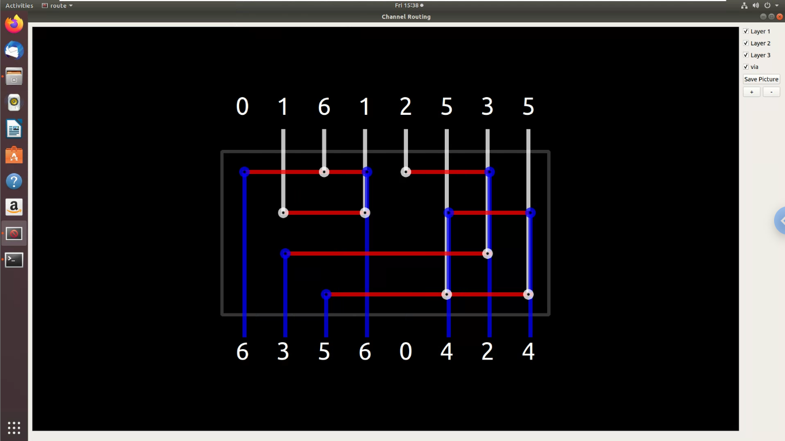
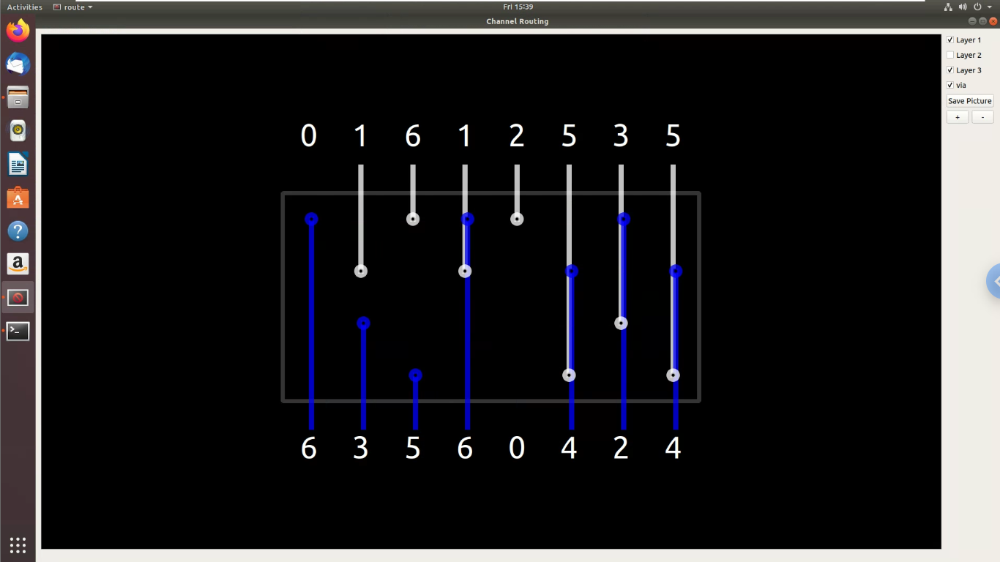

# Channel-Routing

本專案使用 QT5 / C++ 撰寫, 於Ubuntu 18.04可成功編譯並執行。  

* requiement:
  * qt5-default
  * make
  * build-essential

* usage:
```
>  make
>  ./route <file_name>
```
清除編譯後檔案:
```
> make clean
```
若無法成功編譯，請用 apt 安裝 qt5-default。


* Demo

sample.pin :
```
0 1 6 1 2 5 3 5
6 3 5 6 0 4 2 4
```
run:
```
> make
> ./route ./example/sample.pin
```
result:



Switch layers and display: 

